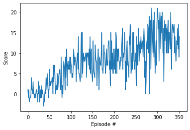

# Banana Collector Report

*By Kyle Palko*

*31 December 2020*

### Introduction
For this project, I decided to train a Deep Q-Network. Given most of my current work is in complex environments, getting a better grasp on deep learning techniques is essential.

Several other algorithms such as Sarsa and TD learning were considered but ultimately discarded since they would require discretizing the state space. Furthermore, it would be difficult to include visuals as an input as in the pixel observations following this project, so DQN seemed like a natural fit.

### Methodology

The random seed was set to 42 to replicate experiments. However, this random seed won't affect the Unity environment so the experiments won't be truly replicated.

I experimented with the hyperparameters in the training configuration file, `dqn_agent.py` and architecure file, `model.py`.
- `LR`:[3e-4 to 5e-4]
- `eps_decay`: [0.99 to 0.999]
- Number of hidden nodes in neural network: 64-128

The ultimate hyperparameters were as follows:

| Hyperparameter | Value |
| --- | --- |
| Number of Episodes | 2000 |
| Max Epsilon | 1.0 |
| Min Epsilon | 0.01 |
| Epsilon Decay | 0.99 |
| Buffer Size | 1e5 |
| Minibatch Size | 64 |
| Gamma | 0.99 |
| Tau | 1e-3 |
|Learning Rate | 3e-4 |
| Update Every (steps) | 4 |

The selected neural network architecture consists of three layers, with 64 nodes in each. The first two layers pass through a RELU activation function.

This architecture was selected because it is fairly small and our environment is not overly complex. We wanted to encourage fast training times with good performance.

### Results

| Model | Training Episodes |
| --- | --- |
| Model A | 442 |
| Model B | 413 |
| Model C | 382 |
| Model D | 427 |
| __Model E__ | __252__ |
| Model F | 283 |

Our best performing model as described in the Methodology section above resulted in solving the environment in only 252 episodes, which is a vast improvement over the baseline as stated by the project. Fig. 1 displays the training performance over time.

| |
| --- |
| *Figure 1: A graph of the performance of the learning agent over time.* |

The selected model can be found in `checkpoint_311220201505.pth`.

### Future Work

1. I would include training time as a way to compare training performance since in the real world we are also concerned about how long (wall clock time) it takes to train, not just the number of episodes.

2. Include Bayesian optimization for hyperparameter search (although this might be more worth than it's work given our performance)

3. It would be interesting to see the performance difference between visual and the ray inputs. My hypothesis is that ray-casting is probably close to ground truth data and should be easier to train on than visuals given the increase in amount of information from visuals.

4. A combination of visual and ray-cast inputs could increase robustness
